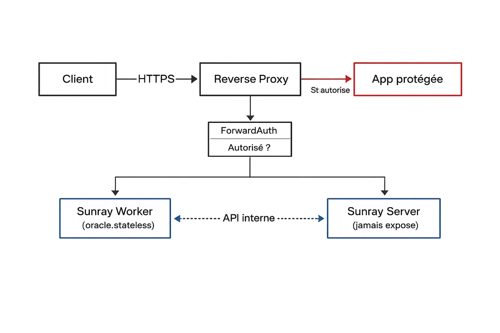

<style>
section {
  font-size: 23px;
  padding: 50px 60px 40px 60px;
  justify-content: flex-start;
}
h1 {
  font-size: 1.6em;
  margin-bottom: 0.2em;
}
h2 {
  font-size: 1.2em;
  margin-top: 0.1em;
  margin-bottom: 0.3em;
}
h3 {
  font-size: 1.0em;
  margin-top: 0.3em;
  margin-bottom: 0.15em;
}
h4 {
  font-size: 0.95em;
  margin-top: 0.2em;
  margin-bottom: 0.1em;
}
ul, ol {
  margin-top: 0.2em;
  margin-bottom: 0.2em;
}
li {
  margin-bottom: 0.1em;
}
p {
  margin-top: 0.3em;
  margin-bottom: 0.3em;
}
blockquote {
  margin-top: 0.3em;
  font-size: 0.9em;
}
pre {
  font-size: 0.85em;
}
table {
  font-size: 0.85em;
}
.columns {
  display: grid;
  grid-template-columns: 1fr 1fr;
  gap: 1.5em;
}
</style>

<!-- _class: lead -->

# **Inouk Sunray**
## Solution Européenne et Open Source de Contrôle d'Accès Zero Trust Web

**Protection moderne, souveraine et économique pour vos applications internes et extranets**

🌞 Sécurité sans complexité • Souveraineté sans compromis • Performance native

---

# La Réalité des Cybermenaces en 2025

## **Toute application exposée sur Internet est une cible**

- **Attaques automatisées 24/7** : Bots malveillants scannent en permanence
- **Exploitation immédiate des CVE** : Les failles sont exploitées dans les heures suivant leur publication
- **Sophistication croissante** : IA générative utilisée pour créer des attaques personnalisées
- **Aucune application n'est trop petite** : Même les outils internes sont ciblés

> 💡 **Fait** : Une application lambda reçoit en moyenne de plusieurs centaines à plusieurs milliers de scans / attaques par jour

---

# Le Coût Réel d'un WAF Efficace

## **Protection Enterprise : Un investissement conséquent**

**WAF SaaS/CDN** (Cloudflare, Akamai, AWS, Azure)
- **Business** : 3 000-10 000€/mois — **Enterprise** : >10 000€/mois

**Appliances/VM** (Fortinet, F5, Barracuda)
- **TCO annuel** : 15 000-50 000€

**Open Source** (ModSecurity)
- **Coût réel** : 35 000-40 000€/an (expertise interne requise)

> ⚠️ **Réalité** : Protection WAF efficace = minimum 15 000€/an par application
> ... et vos données transitent par des infrastructures soumises au Cloud Act américain

---

# Le Dilemme des DSI

## **Protéger sans se ruiner — sans perdre le contrôle de ses données**

### Applications critiques mais à faible valeur ajoutée directe :

- Portails fournisseurs
- Outils de reporting interne
- Applications métier WEB
- Interfaces de gestion WEB
- Extranets partenaires
- Applications soumises au RGPD et à la conformité NIS2

> *"Ces applications ont une audience nominative et connue — ont-elles vraiment besoin d'un WAF enterprise américain ?"*

---

# Statistiques Alarmantes (2025)

📊 **Les chiffres qui font peur :**

- **56%** des organisations ont subi une compromission d'application web dans les 12 derniers mois

- **25%** de toutes les violations de sécurité proviennent de failles applicatives

> 💡 **La réalité** : Les applications **à accès nominatif** mal protégées deviennent les portes d'entrée privilégiées des attaquants

---

# Repenser l'Exposition des Applications Web

## **Deux catégories, deux stratégies de protection**

<div class="columns">
<div>

### 🌐 Applications Publiques
- Sites vitrines, e-commerce, portails grand public
- **Tout le monde** doit pouvoir y accéder
- → Nécessitent un **WAF très sophistiqué** (idéalement basé sur l'IA)
- Sans cela, toujours à la merci d'un exploit zero-day

</div>
<div>

### 🔒 Applications à Accès Nominatif
- Portails fournisseurs, ERP, extranets, outils métier
- Seule une **liste définie d'utilisateurs** doit y accéder
- → Doivent être protégées par une **solution Zero Trust souveraine**
- **C'est pour cela que Sunray a été conçu — en Europe, en Open Source**

</div>
</div>

> 💡 **Conclusion** : Pourquoi payer un WAF Enterprise pour des applications dont on connaît chaque utilisateur par son nom ?

---

# Sunray — La Solution Zero Trust

## **Protection Enterprise Souveraine à Prix Accessible**

*Pour vos applications à accès nominatif, une approche Zero Trust est plus efficace et plus économique qu'un WAF*

### Notre approche :
✅ **Open Source** : Transparence totale, pas de vendor lock-in
✅ **Souveraineté européenne** : Conçu en Europe, hébergé où vous le décidez
✅ **Surface d'attaque minimale** : Architecture coupe-circuit — Sunray ne voit jamais le trafic applicatif
✅ **Authentification moderne** : Passkeys/WebAuthn (biométrie)
✅ **Scalabilité native** : De 10 à "x millions" d'utilisateurs
✅ **Déploiement sans modification** : Vos applications restent intactes

### Résultat :
**Division des coûts par 10** tout en maintenant un niveau de sécurité enterprise

---

# Souveraineté Numérique : Un Impératif Européen

## **Vos données, vos règles, votre infrastructure**

<div class="columns">
<div>

### 📜 Contexte réglementaire européen
- **RGPD** : Amendes jusqu'à 4% du CA mondial
- **Directive NIS2** (oct. 2024) : Obligations de cybersécurité renforcées
- **Arrêt Schrems II** : Transferts UE→US remis en question

### ⚠️ Le problème des solutions US
- **Cloud Act / FISA 702** : Accès aux données exigible par les autorités US, même en Europe
- Cloudflare Access, Zscaler, Okta, Auth0 : juridiction américaine

</div>
<div>

### 🇪🇺 Sunray : la réponse européenne
- **Conçu et développé en Europe**
- **Code source ouvert** : Auditabilité totale, aucune porte dérobée possible
- **Déploiement souverain** : Vos données ne quittent jamais votre infrastructure
- **Aucune dépendance envers un fournisseur non-européen**

> 💡 *"La souveraineté numérique n'est pas un luxe — c'est une responsabilité."*

</div>
</div>

---

# Deux Modèles d'Architecture

## **Un coupe-circuit souverain — ou un proxy serverless global**

<div class="columns">
<div>

### 🏢 Modèle principal — Worker FastAPI
*Middleware ForwardAuth (coupe-circuit)*

Sunray **ne voit jamais le trafic applicatif**. Votre reverse proxy interroge Sunray avant chaque requête → autorisé ou bloqué.

- **Filtre sans encaisser le trafic** — performances intactes
- Référence : **Traefik** ; compatible Nginx, Caddy, HAProxy, Envoy
- **Souveraineté totale** : on-premise ou cloud européen
- Idéal : secteur public, banque, santé, RGPD/NIS2

</div>
<div>

### 🌍 Alternative — Worker Cloudflare
*Reverse Proxy Serverless*

Pour les applications à **audience mondiale** ou sans reverse proxy existant.

- Reverse proxy sur réseau Cloudflare (300+ PoP)
- Intercepte **tout le trafic** — scaling auto, DDoS inclus
- Le serveur Sunray reste sous votre contrôle

</div>
</div>

> 📌 **Dans les deux cas**, le serveur Sunray (cœur décisionnaire) reste sous votre contrôle et n'est jamais exposé sur Internet

---

# Architecture Zero Trust — Mode ForwardAuth (principal)

## **Le coupe-circuit : Sunray filtre, votre proxy route**



- Le worker est un **oracle de décision** — il répond autorisé/refusé, c'est tout
- Le **trafic applicatif ne passe jamais par Sunray** : zéro impact sur les performances
- Le reverse proxy reste maître du routage, du TLS, du load balancing

---

# Architecture Zero Trust — Mode Proxy Serverless (alternative)

## **Le proxy edge : Sunray intercepte et transmet tout le trafic**

```
Client → Cloudflare Edge [Sunray Worker] → Application Protégée
                  ↕ API
            [Sunray Server]
             (jamais exposé)
```

- Le worker **EST** le proxy — il reçoit, authentifie et transmet chaque requête
- Scaling automatique sur 300+ points de présence Cloudflare
- Protection DDoS native incluse
- Pour les cas sans reverse proxy ForwardAuth, ou pour des **applications à audience mondiale**

### Principes communs aux deux modes :
1. **Serveur isolé** : Décisions critiques jamais exposées
2. **Workers stateless** : Aucune donnée sensible en périphérie
3. **Authentification forte** : Biométrie via Passkeys
4. **Souveraineté architecturale** : Le serveur reste dans votre infrastructure

---

# Fonctionnalités Clés

## **Tout ce dont vous avez besoin**

<div class="columns">
<div>

### 🔐 Contrôle d'accès
- Authentification sans mot de passe (Passkeys)
- Règles d'accès granulaires
- Support API/Webhooks natif

### 🛡️ Sécurité
- Protection Zero-Day complète
- Audit trail complet

</div>
<div>

### 🎯 Simplicité
- Interface graphique évoluée
- Configuration centralisée
- Aucune modification des applications

### 🏛️ Conformité
- Compatible RGPD et NIS2
- Audit trail complet
- Déploiement souverain on-premise

</div>
</div>

---

# Cas d'Usage Typiques

#### ✅ **Parfait pour vos applications à accès nominatif :**
- **Portails clients/fournisseurs** : Accès sécurisé sans VPN
- **Applications métier** : ERP, CRM, outils internes exposés
- **APIs et webhooks** : Protection transparente des échanges M2M
- **Sites de staging** : Sécurisation des environnements de test
- **Extranets** : Collaboration sécurisée avec les partenaires
- **Applications réglementées** : Santé, finance, secteur public — conformité RGPD/NIS2 native

#### 💰 **ROI immédiat :**
- Réduction de 90% des coûts vs WAF traditionnel
- Déploiement en moins de 2 heures, Zéro modification du code existant

---

# Comparaison avec la Concurrence

| Critère | WAF Enterprise | VPN | Sunray |
|---------|---------------|-----|--------|
| **Coût mensuel** | 5000-15000€ | 500-2000€ | **50-500€** |
| **Complexité** | Élevée | Moyenne | **Faible** |
| **Modification apps** | Parfois | Non | **Jamais** |
| **Protection Zero-Day** | ✅ | ❌ | **✅** |
| **Expérience utilisateur** | Transparente | Contraignante | **Transparente** |
| **Scalabilité** | Coûteuse | Limitée | **Native** |
| **Open Source** | ❌ | Parfois | **✅** |
| **Souveraineté données** | ❌ (US) | Partielle | **✅** |
| **Conformité RGPD/NIS2** | Complexe | Partielle | **Native** |

> 📌 **Sunray ne remplace pas un WAF pour les applications publiques — il élimine le besoin d'un WAF pour les applications à accès nominatif, tout en garantissant la souveraineté de vos données**

---

# Architecture Technique

## **Simple mais Puissant**

<div class="columns">
<div>

### **Sunray Server** (Odoo 18)
- Gestion centralisée des politiques
- Interface d'administration web
- API REST complète
- Déploiement on-premise ou cloud souverain

### **Sunray Worker FastAPI** (principal)
*Middleware ForwardAuth*
- Décision d'accès (autorise / refuse / redirige)
- Compatible : Traefik, Nginx, Caddy, HAProxy, Envoy
- Cache Redis/DragonflyDB — Docker/Kubernetes

</div>
<div>

### **Sunray Worker Cloudflare** (alternative)
*Reverse Proxy Serverless*
- Proxy serverless sur réseau edge Cloudflare
- Intercepte et route toutes les requêtes
- Cache Cloudflare KV — Scaling mondial auto

</div>
</div>

---

# Modèle de Licence

## **Choisissez votre niveau de support**

### 🆓 **Sunray Core** (Open Source)
- Fonctionnalités de base, Authentification Passkeys, Community support

### 💼 **Sunray Advanced** (Licence)
- Règles d'accès avancées, Audit log complet, Support professionnel

### 🏢 **Sunray Enterprise** (Package complet)
- Services professionnels, Formation et onboarding, Support dédié

---

# Roadmap Produit 2025-2026

## **Notre Vision**

### ✅ **Disponible aujourd'hui**
- Sunray Worker FASTAPI, Sunray Worker for Cloudflare, Authentification Passkeys et Mail, Multi hosts, API REST

### 🚧 **T2 2026**
- Analytics dashboard

### 🔮 **T3-T4 2026**
- Certifications de conformité (SOC2, ISO27001)
- Qualification SecNumCloud (ANSSI)

---

<!-- _class: lead -->

# **Protégez vos Applications dès Aujourd'hui**

## 🚀 **Essai Gratuit 30 jours**

### 📞 **Contact**
**Email** : cmorisse@oursbl.eu
**Source** : gitlab.com/cmorisse/sunray-server, gitlab.com/cmorisse/sunray-worker-fastapi, gitlab.com/cmorisse/sunray-worker-cloudflare

### 💡 **Prochaines étapes**
1. Proof of Concept sur application pilote
2. Déploiement en production
3. Évaluation de conformité RGPD/NIS2

> *"Security is a pain, not a feature — so let's make it affordable, sovereign, and invisible."*
