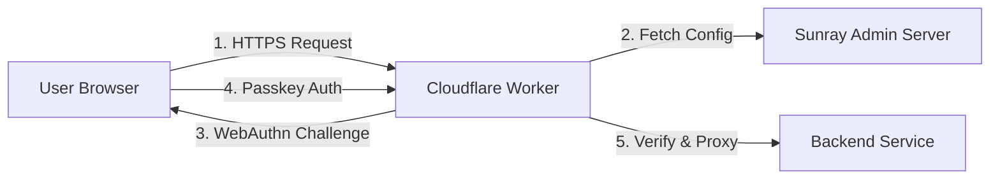

# Muppy Sunray Worker v3 Specification - WebAuthn with Passkeys

## 🌞 Overview

The **Muppy Sunray Worker** is a Cloudflare Worker that provides secure, passwordless authentication for HTTP services using WebAuthn passkeys. It acts as a reverse proxy, validating user authentication before forwarding requests to backend services.

**Available in two editions:**
- **Sunray (Free)**: Complete authentication system with manual token delivery
- **Sunray Advanced (Paid)**: Enhanced with automation, MFA, advanced policies, and enterprise integrations

## 🏗️ Architecture



## 🔐 Authentication Flows

### First-Time Setup Flow

1. User visits `https://{domain}/setup`
2. Worker serves setup form
3. User enters username and one-time token
4. Worker validates token hash with Admin Server
5. Worker serves WebAuthn registration page
6. User creates passkey with biometric/PIN
7. Worker sends credential to Admin Server
8. Session cookie established

### Authentication Flow (Returning Users)

1. User visits protected resource
2. Worker checks session cookie
3. If invalid/missing, redirect to `/auth/login`
4. Worker serves passkey authentication page
5. User authenticates with passkey
6. Worker verifies signature
7. New session cookie established
8. Original request proxied to backend

## 📋 Worker Endpoints

### Public Endpoints

| Path | Method | Description |
|------|--------|-------------|
| `/setup` | GET | Setup form for first-time users |
| `/setup/validate` | POST | Validate setup token |
| `/setup/register` | POST | Complete WebAuthn registration |
| `/auth/login` | GET | Passkey login page |
| `/auth/challenge` | POST | Get WebAuthn challenge |
| `/auth/verify` | POST | Verify passkey assertion |
| `/auth/logout` | POST | Clear session |

### Admin Endpoints

| Path | Method | Description |
|------|--------|-------------|
| `/api/cache/invalidate` | POST | Force config cache refresh |
| `/api/health` | GET | Health check endpoint |

## 🔧 Implementation Details

### Environment Variables

```javascript
// Required
const ADMIN_API_ENDPOINT = env.ADMIN_API_ENDPOINT; // https://admin.muppy.cloud
const ADMIN_API_KEY = env.ADMIN_API_KEY;           // Bearer token
const SUNRAY_EDITION = env.SUNRAY_EDITION || 'free'; // 'free' or 'advanced'

// Optional with defaults
const SESSION_DURATION = env.SESSION_DURATION || 28800;     // 8 hours (fixed in free)
const CACHE_DURATION = env.CACHE_DURATION || 300;           // 5 minutes
const CHALLENGE_TIMEOUT = env.CHALLENGE_TIMEOUT || 120;     // 2 minutes
const RP_ID = env.RP_ID || "sunray.muppy.cloud";           // Relying party ID
const RP_NAME = env.RP_NAME || "Muppy Sunray";             // Display name
```

### KV Namespaces

```javascript
// Bindings in wrangler.toml
[[kv_namespaces]]
binding = "SESSIONS"
id = "session-store-id"

[[kv_namespaces]]
binding = "CHALLENGES"
id = "challenge-store-id"

[[kv_namespaces]]
binding = "CONFIG_CACHE"
id = "config-cache-id"
```

### Configuration Fetching

```javascript
async function getConfig(forceRefresh = false) {
  if (!forceRefresh) {
    // Check cache first
    const cached = await env.CONFIG_CACHE.get('config');
    if (cached) {
      return JSON.parse(cached);
    }
  }
  
  // Fetch from Admin Server
  const response = await fetch(`${ADMIN_API_ENDPOINT}/api/v1/config`, {
    headers: {
      'Authorization': `Bearer ${ADMIN_API_KEY}`,
      'X-Worker-ID': env.WORKER_ID
    }
  });
  
  if (!response.ok) {
    throw new Error(`Config fetch failed: ${response.status}`);
  }
  
  const config = await response.json();
  
  // Cache with TTL
  await env.CONFIG_CACHE.put(
    'config',
    JSON.stringify(config),
    { expirationTtl: CACHE_DURATION }
  );
  
  return config;
}
```

### WebAuthn Registration Options

```javascript
function getRegistrationOptions(user) {
  return {
    challenge: generateRandomBuffer(32),
    rp: {
      id: RP_ID,
      name: RP_NAME
    },
    user: {
      id: new TextEncoder().encode(user.username),
      name: user.username,
      displayName: user.display_name || user.username
    },
    pubKeyCredParams: [
      { alg: -7, type: "public-key" },   // ES256 (preferred)
      { alg: -257, type: "public-key" }  // RS256 (fallback)
    ],
    authenticatorSelection: {
      residentKey: "required",
      requireResidentKey: true,
      userVerification: "required"
    },
    timeout: CHALLENGE_TIMEOUT * 1000,
    attestation: "none"
  };
}
```

### WebAuthn Authentication Options

```javascript
function getAuthenticationOptions() {
  return {
    challenge: generateRandomBuffer(32),
    rpId: RP_ID,
    userVerification: "required",
    timeout: CHALLENGE_TIMEOUT * 1000
    // No allowCredentials - browser shows all available passkeys
  };
}
```

### Edition Feature Detection

```javascript
// Feature availability based on edition
const FEATURES = {
  // Always available (Free + Advanced)
  passkey_auth: true,
  basic_sessions: true,
  audit_logging: true,
  user_management: true,
  unlimited_servers: true,
  admin_users: true,
  basic_monitoring: true,
  read_only_api: true,
  
  // Advanced edition only
  advanced_sessions: isAdvanced(),
  mfa_totp: isAdvanced(),
  emergency_access: isAdvanced(),
  rate_limiting: isAdvanced(),
  security_alerts: isAdvanced(),
  compliance_reports: isAdvanced(),
  bulk_operations: isAdvanced(),
  self_service_portal: isAdvanced(),
  full_api_access: isAdvanced(),
  saml_oidc: isAdvanced(),
  hr_sync: isAdvanced(),
  chat_integrations: isAdvanced(),
  advanced_monitoring: isAdvanced()
};

function isAdvanced() {
  return SUNRAY_EDITION === 'advanced';
}

function requiresAdvanced(feature) {
  if (!FEATURES[feature]) {
    throw new Error(`Feature '${feature}' requires Sunray Advanced`);
  }
}
```

### Session Management

```javascript
// Get session duration based on edition and policies
function getSessionDuration(host, user) {
  if (FEATURES.advanced_sessions) {
    // Advanced: Use host or user-specific durations
    return host.session_duration_override || 
           user.default_session_duration || 
           SESSION_DURATION;
  }
  // Free: Fixed 8 hours
  return 28800;
}

// Check advanced session policies
function validateSessionPolicy(request, sessionData, host) {
  if (!FEATURES.advanced_sessions) {
    // Free edition: basic IP check only
    const currentIP = request.headers.get('CF-Connecting-IP');
    return sessionData.ip === currentIP;
  }
  
  // Advanced: Enhanced validation
  const currentIP = request.headers.get('CF-Connecting-IP');
  const policies = host.session_policies || {};
  
  // IP binding policy
  if (policies.strict_ip_binding && sessionData.ip !== currentIP) {
    return false;
  }
  
  // Device trust level
  if (policies.require_trusted_device && !sessionData.deviceTrusted) {
    return false;
  }
  
  return true;
}

async function createSession(username, credentialId, request, host) {
  const sessionId = generateRandomId();
  const duration = getSessionDuration(host, { username });
  
  const sessionData = {
    username,
    credentialId,
    createdAt: Date.now(),
    ip: request.headers.get('CF-Connecting-IP'),
    userAgent: request.headers.get('User-Agent'),
    deviceTrusted: FEATURES.advanced_sessions ? await checkDeviceTrust(credentialId) : true
  };
  
  await env.SESSIONS.put(
    `session:${sessionId}`,
    JSON.stringify(sessionData),
    { expirationTtl: duration }
  );
  
  return sessionId;
}

function getSessionCookie(sessionId, duration) {
  return `sunray_session=${sessionId}; Domain=${RP_ID}; Path=/; Secure; HttpOnly; SameSite=Lax; Max-Age=${duration}`;
}
```

### Rate Limiting (Advanced Only)

```javascript
async function checkRateLimit(request, username) {
  if (!FEATURES.rate_limiting) {
    return { allowed: true }; // No rate limiting in free edition
  }
  
  const ip = request.headers.get('CF-Connecting-IP');
  const now = Date.now();
  const windowMs = 60000; // 1 minute window
  
  // Per-user rate limiting
  const userKey = `rate:user:${username}:${Math.floor(now / windowMs)}`;
  const userCount = await env.RATE_LIMIT.get(userKey) || 0;
  
  if (parseInt(userCount) >= 30) { // 30 requests per minute per user
    return { allowed: false, reason: 'User rate limit exceeded' };
  }
  
  // Per-IP rate limiting
  const ipKey = `rate:ip:${ip}:${Math.floor(now / windowMs)}`;
  const ipCount = await env.RATE_LIMIT.get(ipKey) || 0;
  
  if (parseInt(ipCount) >= 100) { // 100 requests per minute per IP
    return { allowed: false, reason: 'IP rate limit exceeded' };
  }
  
  // Increment counters
  await env.RATE_LIMIT.put(userKey, (parseInt(userCount) + 1).toString(), { expirationTtl: windowMs / 1000 });
  await env.RATE_LIMIT.put(ipKey, (parseInt(ipCount) + 1).toString(), { expirationTtl: windowMs / 1000 });
  
  return { allowed: true };
}
```

### Request Proxying

```javascript
async function proxyRequest(request, backendUrl, user, sessionData) {
  // Rate limiting check (Advanced only)
  const rateLimitResult = await checkRateLimit(request, user.username);
  if (!rateLimitResult.allowed) {
    return new Response('Rate limit exceeded', { 
      status: 429,
      headers: { 'Retry-After': '60' }
    });
  }
  
  // Clone request with backend URL
  const proxyRequest = new Request(backendUrl, request);
  
  // Add authentication headers
  const headers = new Headers(proxyRequest.headers);
  headers.set('X-Sunray-User', user.username);
  headers.set('X-Sunray-Email', user.email);
  headers.set('X-Sunray-Authenticated', 'true');
  headers.set('X-Sunray-Edition', SUNRAY_EDITION);
  
  // Advanced headers
  if (FEATURES.advanced_sessions) {
    headers.set('X-Sunray-Session-ID', sessionData.sessionId);
    headers.set('X-Sunray-Device-Trusted', sessionData.deviceTrusted.toString());
  }
  
  // Forward request
  const response = await fetch(proxyRequest, {
    headers,
    redirect: 'manual'
  });
  
  // Security alerts (Advanced only)
  if (FEATURES.security_alerts && response.status >= 400) {
    await logSecurityEvent({
      type: 'backend_error',
      user: user.username,
      status: response.status,
      url: backendUrl
    });
  }
  
  // Add security headers to response
  const proxyResponse = new Response(response.body, response);
  const responseHeaders = new Headers(proxyResponse.headers);
  
  // Security headers
  responseHeaders.set('X-Content-Type-Options', 'nosniff');
  responseHeaders.set('X-Frame-Options', 'DENY');
  responseHeaders.set('Referrer-Policy', 'strict-origin-when-cross-origin');
  
  return new Response(proxyResponse.body, {
    status: proxyResponse.status,
    statusText: proxyResponse.statusText,
    headers: responseHeaders
  });
}
```

### HTML Templates

```javascript
const LOGIN_HTML = `<!DOCTYPE html>
<html>
<head>
  <meta charset="UTF-8">
  <meta name="viewport" content="width=device-width, initial-scale=1.0">
  <title>Sign in - Muppy Sunray</title>
  <style>
    body { font-family: system-ui; max-width: 400px; margin: 100px auto; padding: 20px; }
    button { width: 100%; padding: 15px; font-size: 16px; }
    .error { color: red; margin: 10px 0; }
  </style>
</head>
<body>
  <h1>Sign in with Passkey</h1>
  <button onclick="authenticate()">Sign In</button>
  <div id="error" class="error"></div>
  
  <script>
    async function authenticate() {
      try {
        // Get challenge
        const challengeResp = await fetch('/auth/challenge', { method: 'POST' });
        const options = await challengeResp.json();
        
        // Convert base64 to ArrayBuffer
        options.challenge = base64ToArrayBuffer(options.challenge);
        
        // Get credential
        const credential = await navigator.credentials.get({ publicKey: options });
        
        // Send to server
        const verifyResp = await fetch('/auth/verify', {
          method: 'POST',
          headers: { 'Content-Type': 'application/json' },
          body: JSON.stringify({
            id: credential.id,
            rawId: arrayBufferToBase64(credential.rawId),
            response: {
              authenticatorData: arrayBufferToBase64(credential.response.authenticatorData),
              clientDataJSON: arrayBufferToBase64(credential.response.clientDataJSON),
              signature: arrayBufferToBase64(credential.response.signature),
              userHandle: arrayBufferToBase64(credential.response.userHandle)
            },
            type: credential.type
          })
        });
        
        if (verifyResp.ok) {
          // Redirect to original URL or home
          const url = new URLSearchParams(window.location.search).get('redirect') || '/';
          window.location.href = url;
        } else {
          const error = await verifyResp.text();
          document.getElementById('error').textContent = error;
        }
      } catch (err) {
        document.getElementById('error').textContent = err.message;
      }
    }
    
    function base64ToArrayBuffer(base64) {
      const binary = atob(base64);
      const bytes = new Uint8Array(binary.length);
      for (let i = 0; i < binary.length; i++) {
        bytes[i] = binary.charCodeAt(i);
      }
      return bytes.buffer;
    }
    
    function arrayBufferToBase64(buffer) {
      const bytes = new Uint8Array(buffer);
      let binary = '';
      for (let i = 0; i < bytes.byteLength; i++) {
        binary += String.fromCharCode(bytes[i]);
      }
      return btoa(binary);
    }
  </script>
</body>
</html>`;
```

## 🚀 Deployment

### 1. Create KV Namespaces

```bash
wrangler kv:namespace create "SESSIONS"
wrangler kv:namespace create "CHALLENGES"
wrangler kv:namespace create "CONFIG_CACHE"
```

### 2. Configure wrangler.toml

```toml
name = "muppy-sunray-worker"
main = "src/index.js"
compatibility_date = "2024-01-31"

# KV Namespaces (all editions)
[[kv_namespaces]]
binding = "SESSIONS"
id = "your-sessions-namespace-id"

[[kv_namespaces]]
binding = "CHALLENGES"
id = "your-challenges-namespace-id"

[[kv_namespaces]]
binding = "CONFIG_CACHE"
id = "your-config-namespace-id"

# Advanced edition only
[[kv_namespaces]]
binding = "RATE_LIMIT"
id = "your-rate-limit-namespace-id"

[[kv_namespaces]]
binding = "SECURITY_EVENTS"
id = "your-security-events-namespace-id"

[vars]
RP_ID = "sunray.muppy.cloud"
RP_NAME = "Muppy Sunray"
SUNRAY_EDITION = "free"  # or "advanced"
SESSION_DURATION = "28800"
CACHE_DURATION = "300"
CHALLENGE_TIMEOUT = "120"
```

### 3. Set Secrets

```bash
wrangler secret put ADMIN_API_ENDPOINT
wrangler secret put ADMIN_API_KEY

# Advanced edition only
wrangler secret put SUNRAY_LICENSE_KEY  # For advanced features validation
```

### 4. Deploy

```bash
wrangler deploy
```

## 🔒 Security Considerations

### Headers Added to Proxied Requests

**All Editions:**
- `X-Sunray-User`: Authenticated username
- `X-Sunray-Email`: User email address  
- `X-Sunray-Authenticated`: Always "true"
- `X-Sunray-Edition`: "free" or "advanced"

**Advanced Edition Only:**
- `X-Sunray-Session-ID`: Unique session identifier
- `X-Sunray-Device-Trusted`: Device trust level
- `X-Sunray-MFA-Verified`: MFA completion status (if enabled)

### Security Headers on Responses

- `X-Content-Type-Options: nosniff`
- `X-Frame-Options: DENY`
- `X-XSS-Protection: 1; mode=block`
- `Referrer-Policy: strict-origin-when-cross-origin`
- `Content-Security-Policy`: Restrictive policy for auth pages

### Session Security

**Free Edition:**
- HTTP-only cookies prevent JS access
- Secure flag ensures HTTPS only
- SameSite=Lax prevents CSRF
- Basic IP binding detects session hijacking
- Fixed 8-hour expiration

**Advanced Edition Enhancements:**
- Advanced session policies (strict IP binding, device trust)
- Custom session durations per host/user
- Device fingerprinting and trust levels
- Session activity monitoring and anomaly detection
- Emergency session termination capabilities

## 📊 Monitoring

### Basic Metrics (All Editions)

- Authentication success/failure rates
- Session creation/validation counts
- Backend response times
- Cache hit/miss ratios
- WebAuthn timeout rates

### Advanced Metrics (Advanced Edition Only)

- Rate limiting events and patterns
- Security alerts and threat detection
- Device trust level distribution
- MFA completion rates
- Emergency access usage
- API usage patterns
- Compliance audit events

### Logging Format

**Free Edition:**
```json
{
  "timestamp": "2024-01-31T10:15:30Z",
  "level": "info",
  "event": "auth.success",
  "user": "alice",
  "credential_id": "AXkp...",
  "ip": "203.0.113.45",
  "duration_ms": 245,
  "edition": "free"
}
```

**Advanced Edition (Enhanced):**
```json
{
  "timestamp": "2024-01-31T10:15:30Z",
  "level": "info",
  "event": "auth.success",
  "user": "alice",
  "credential_id": "AXkp...",
  "ip": "203.0.113.45",
  "duration_ms": 245,
  "edition": "advanced",
  "session_id": "sess_abc123",
  "device_trusted": true,
  "mfa_verified": true,
  "risk_score": 0.1,
  "policy_applied": "standard"
}
```

## 📋 Feature Comparison

| Feature | Sunray (Free) | Sunray Advanced |
|---------|---------------|------------------|
| **Authentication** |
| WebAuthn Passkeys | ✅ | ✅ |
| Session Management | ✅ Basic | ✅ Advanced Policies |
| Multi-Factor Auth | ❌ | ✅ TOTP |
| Emergency Access | ❌ | ✅ Admin Override |
| **Security** |
| Audit Logging | ✅ | ✅ |
| Security Alerts | ❌ | ✅ |
| Rate Limiting | ❌ | ✅ Advanced |
| **Operations** |
| Admin Users | ✅ | ✅ + Roles |
| Servers Protected | ♾️ | ♾️ |
| Monitoring | 📊 Basic | 📈 Advanced + Prometheus |
| API Access | ✅ Read-only | ✅ Full API |

## 🧪 Testing

### Unit Tests
- Challenge generation and validation
- Session management functions
- Configuration parsing
- Security header application
- Feature gate validation
- Edition-specific functionality

### Integration Tests
- Full authentication flow
- Setup token validation
- Session persistence
- Cache behavior
- Rate limiting (Advanced)
- MFA flow (Advanced)

### End-to-End Tests
- Browser automation with real passkeys
- Multi-domain testing
- Session timeout verification
- Error handling scenarios
- Edition upgrade/downgrade scenarios
- Advanced feature activation