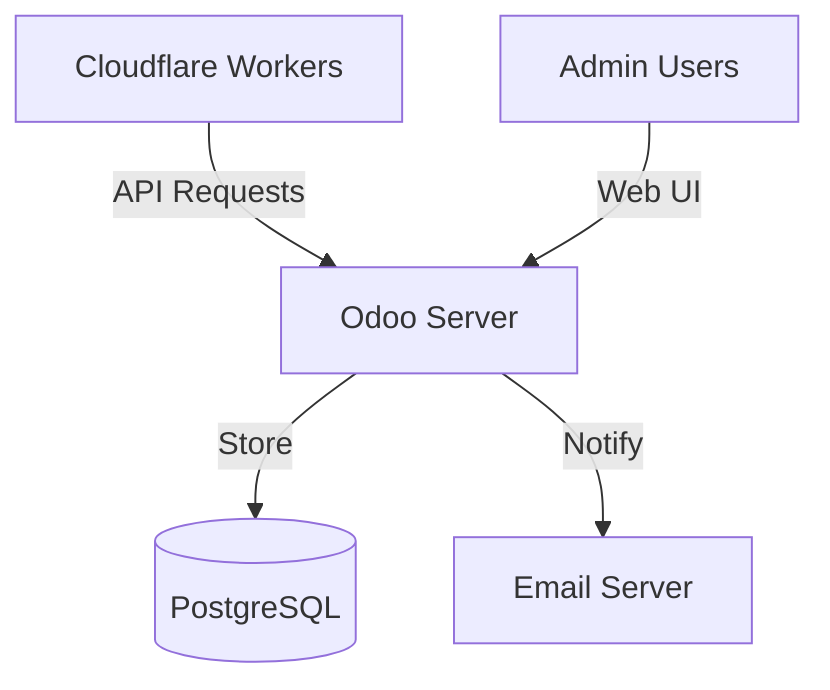

# Sunray Admin Server v3 Specification - Odoo 18 Addon

## 🎯 Overview

The **Sunray Admin Server** is an Odoo 18 addon that provides centralized configuration management, user administration, and setup token generation for the Muppy Sunray authentication system. It serves as the backend API for Cloudflare Workers and includes a web interface for administrators.

## 🏗️ Architecture



## 📦 Odoo Module Structure

```
sunray_admin/
├── __init__.py
├── __manifest__.py
├── security/
│   ├── ir.model.access.csv
│   └── sunray_security.xml
├── models/
│   ├── __init__.py
│   ├── sunray_user.py
│   ├── sunray_passkey.py
│   ├── sunray_setup_token.py
│   ├── sunray_host.py
│   └── sunray_audit_log.py
├── controllers/
│   ├── __init__.py
│   └── api.py
├── views/
│   ├── sunray_user_views.xml
│   ├── sunray_host_views.xml
│   ├── sunray_menu.xml
│   └── sunray_dashboard.xml
├── wizards/
│   ├── __init__.py
│   └── setup_token_wizard.py
├── data/
│   └── sunray_data.xml
└── static/
    └── description/
        └── icon.png
```

## 🗄️ Data Models

### sunray.user

```python
class SunrayUser(models.Model):
    _name = 'sunray.user'
    _description = 'Sunray User'
    _rec_name = 'username'
    
    username = fields.Char(string='Username', required=True, index=True)
    email = fields.Char(string='Email', required=True)
    display_name = fields.Char(string='Display Name')
    active = fields.Boolean(default=True)
    created_date = fields.Datetime(default=fields.Datetime.now)
    
    # Relations
    passkey_ids = fields.One2many('sunray.passkey', 'user_id', string='Passkeys')
    setup_token_ids = fields.One2many('sunray.setup.token', 'user_id', string='Setup Tokens')
    host_ids = fields.Many2many('sunray.host', string='Authorized Hosts')
    
    # Computed fields
    passkey_count = fields.Integer(compute='_compute_passkey_count')
    last_login = fields.Datetime(compute='_compute_last_login')
    
    _sql_constraints = [
        ('username_unique', 'UNIQUE(username)', 'Username must be unique!')
    ]
```

### sunray.passkey

```python
class SunrayPasskey(models.Model):
    _name = 'sunray.passkey'
    _description = 'Sunray Passkey'
    
    user_id = fields.Many2one('sunray.user', required=True, ondelete='cascade')
    credential_id = fields.Char(string='Credential ID', required=True, index=True)
    public_key = fields.Text(string='Public Key', required=True)
    name = fields.Char(string='Device Name', required=True)
    created_date = fields.Datetime(default=fields.Datetime.now)
    last_used = fields.Datetime()
    backup_eligible = fields.Boolean(string='Backup Eligible')
    backup_state = fields.Boolean(string='Backup State')
    
    # Audit fields
    created_ip = fields.Char(string='Registration IP')
    created_user_agent = fields.Text(string='Registration User Agent')
    
    _sql_constraints = [
        ('credential_unique', 'UNIQUE(credential_id)', 'Credential ID must be unique!')
    ]
```

### sunray.setup.token

```python
class SunraySetupToken(models.Model):
    _name = 'sunray.setup.token'
    _description = 'Setup Token'
    
    user_id = fields.Many2one('sunray.user', required=True, ondelete='cascade')
    token_hash = fields.Char(string='Token Hash (SHA-512)', required=True)
    device_name = fields.Char(string='Device Name')
    expires_at = fields.Datetime(string='Expiration', required=True)
    consumed = fields.Boolean(default=False)
    consumed_date = fields.Datetime()
    
    # Constraints
    allowed_ips = fields.Text(string='Allowed IPs (JSON)', default='[]')
    max_uses = fields.Integer(default=1)
    current_uses = fields.Integer(default=0)
    
    # Generation info
    generated_by = fields.Many2one('res.users')
    generated_date = fields.Datetime(default=fields.Datetime.now)
    
    @api.model
    def cleanup_expired(self):
        """Cron job to clean expired tokens"""
        expired = self.search([
            ('expires_at', '<', fields.Datetime.now()),
            ('consumed', '=', False)
        ])
        expired.unlink()
```

### sunray.host

```python
class SunrayHost(models.Model):
    _name = 'sunray.host'
    _description = 'Protected Host'
    
    domain = fields.Char(string='Domain', required=True, index=True)
    backend_url = fields.Char(string='Backend URL', required=True)
    active = fields.Boolean(default=True)
    
    # Access control
    user_ids = fields.Many2many('sunray.user', string='Authorized Users')
    allowed_ips = fields.Text(string='Allowed IPs (JSON)', default='[]')
    
    # Overrides
    session_duration = fields.Integer(string='Session Duration (seconds)')
    require_mfa = fields.Boolean(string='Require MFA', default=False)
    
    _sql_constraints = [
        ('domain_unique', 'UNIQUE(domain)', 'Domain must be unique!')
    ]
```

### sunray.audit.log

```python
class SunrayAuditLog(models.Model):
    _name = 'sunray.audit.log'
    _description = 'Audit Log'
    _order = 'timestamp desc'
    
    timestamp = fields.Datetime(default=fields.Datetime.now, index=True)
    event_type = fields.Selection([
        ('auth.success', 'Authentication Success'),
        ('auth.failure', 'Authentication Failure'),
        ('token.generated', 'Token Generated'),
        ('token.consumed', 'Token Consumed'),
        ('passkey.registered', 'Passkey Registered'),
        ('passkey.revoked', 'Passkey Revoked'),
        ('config.fetched', 'Config Fetched'),
    ], required=True)
    
    user_id = fields.Many2one('sunray.user')
    username = fields.Char()  # Store even if user deleted
    ip_address = fields.Char()
    user_agent = fields.Text()
    details = fields.Text()  # JSON field for extra data
    
    # Auto-cleanup old logs
    @api.model
    def cleanup_old_logs(self):
        """Keep last 90 days of logs"""
        cutoff = fields.Datetime.now() - timedelta(days=90)
        old_logs = self.search([('timestamp', '<', cutoff)])
        old_logs.unlink()
```

## 🔌 API Endpoints

### Authentication

All API endpoints require Bearer token authentication:

```python
def _authenticate_api(self, request):
    auth_header = request.httprequest.headers.get('Authorization', '')
    if not auth_header.startswith('Bearer '):
        return False
    
    token = auth_header[7:]
    # Validate against api.keys model
    api_key = request.env['api.key'].sudo().search([
        ('key', '=', token),
        ('active', '=', True)
    ])
    return bool(api_key)
```

### Configuration Endpoint

```python
@http.route('/api/v1/config', type='json', auth='none', methods=['GET'])
def get_config(self, **kwargs):
    if not self._authenticate_api(request):
        return {'error': 'Unauthorized'}, 401
    
    # Build configuration
    config = {
        'version': 3,
        'generated_at': fields.Datetime.now(),
        'users': {},
        'hosts': []
    }
    
    # Add users
    users = request.env['sunray.user'].sudo().search([('active', '=', True)])
    for user in users:
        config['users'][user.username] = {
            'email': user.email,
            'display_name': user.display_name,
            'created_at': user.created_date.isoformat(),
            'passkeys': []
        }
        
        # Add passkeys
        for passkey in user.passkey_ids:
            config['users'][user.username]['passkeys'].append({
                'credential_id': passkey.credential_id,
                'public_key': passkey.public_key,
                'name': passkey.name,
                'created_at': passkey.created_date.isoformat(),
                'backup_eligible': passkey.backup_eligible,
                'backup_state': passkey.backup_state
            })
    
    # Add hosts
    hosts = request.env['sunray.host'].sudo().search([('active', '=', True)])
    for host in hosts:
        config['hosts'].append({
            'domain': host.domain,
            'backend': host.backend_url,
            'authorized_users': host.user_ids.mapped('username'),
            'allowed_ips': json.loads(host.allowed_ips or '[]'),
            'session_duration_override': host.session_duration
        })
    
    return config
```

### Token Validation

```python
@http.route('/api/v1/setup-tokens/validate', type='json', auth='none', methods=['POST'])
def validate_token(self, username, token_hash, client_ip, **kwargs):
    if not self._authenticate_api(request):
        return {'error': 'Unauthorized'}, 401
    
    # Find user and token
    user = request.env['sunray.user'].sudo().search([
        ('username', '=', username),
        ('active', '=', True)
    ])
    
    if not user:
        return {'valid': False, 'error': 'User not found'}
    
    # Find matching token
    token = request.env['sunray.setup.token'].sudo().search([
        ('user_id', '=', user.id),
        ('token_hash', '=', token_hash),
        ('consumed', '=', False),
        ('expires_at', '>', fields.Datetime.now())
    ])
    
    if not token:
        return {'valid': False, 'error': 'Invalid or expired token'}
    
    # Check constraints
    allowed_ips = json.loads(token.allowed_ips or '[]')
    if allowed_ips and not self._check_ip_allowed(client_ip, allowed_ips):
        return {'valid': False, 'error': 'IP not allowed'}
    
    # Check usage limit
    if token.current_uses >= token.max_uses:
        return {'valid': False, 'error': 'Token usage limit exceeded'}
    
    # Mark as consumed
    token.write({
        'current_uses': token.current_uses + 1,
        'consumed': token.current_uses + 1 >= token.max_uses,
        'consumed_date': fields.Datetime.now()
    })
    
    # Log event
    request.env['sunray.audit.log'].sudo().create({
        'event_type': 'token.consumed',
        'user_id': user.id,
        'username': username,
        'ip_address': client_ip,
        'details': json.dumps({'token_id': token.id})
    })
    
    return {'valid': True, 'user': {
        'username': user.username,
        'email': user.email,
        'display_name': user.display_name
    }}
```

### Passkey Registration

```python
@http.route('/api/v1/users/<string:username>/passkeys', type='json', auth='none', methods=['POST'])
def register_passkey(self, username, credential_id, public_key, name, client_ip, user_agent, **kwargs):
    if not self._authenticate_api(request):
        return {'error': 'Unauthorized'}, 401
    
    user = request.env['sunray.user'].sudo().search([('username', '=', username)])
    if not user:
        return {'error': 'User not found'}, 404
    
    # Create passkey
    passkey = request.env['sunray.passkey'].sudo().create({
        'user_id': user.id,
        'credential_id': credential_id,
        'public_key': public_key,
        'name': name,
        'created_ip': client_ip,
        'created_user_agent': user_agent,
        'backup_eligible': kwargs.get('backup_eligible', False),
        'backup_state': kwargs.get('backup_state', False)
    })
    
    # Log event
    request.env['sunray.audit.log'].sudo().create({
        'event_type': 'passkey.registered',
        'user_id': user.id,
        'username': username,
        'ip_address': client_ip,
        'user_agent': user_agent,
        'details': json.dumps({'passkey_id': passkey.id, 'name': name})
    })
    
    return {'success': True, 'passkey_id': passkey.id}
```

## 🖥️ Admin Interface

### Menu Structure

```xml
<!-- Main menu -->
<menuitem id="menu_sunray_root" 
          name="Sunray Admin" 
          web_icon="sunray_admin,static/description/icon.png"/>

<!-- Configuration -->
<menuitem id="menu_sunray_config" 
          name="Configuration" 
          parent="menu_sunray_root"/>
          
<menuitem id="menu_sunray_users" 
          name="Users" 
          parent="menu_sunray_config" 
          action="action_sunray_users"/>
          
<menuitem id="menu_sunray_hosts" 
          name="Protected Hosts" 
          parent="menu_sunray_config" 
          action="action_sunray_hosts"/>

<!-- Monitoring -->
<menuitem id="menu_sunray_monitoring" 
          name="Monitoring" 
          parent="menu_sunray_root"/>
          
<menuitem id="menu_sunray_audit" 
          name="Audit Logs" 
          parent="menu_sunray_monitoring" 
          action="action_sunray_audit_logs"/>
```

### User Management View

```xml
<record id="view_sunray_user_form" model="ir.ui.view">
    <field name="name">sunray.user.form</field>
    <field name="model">sunray.user</field>
    <field name="arch" type="xml">
        <form>
            <header>
                <button name="generate_setup_token" 
                        string="Generate Setup Token" 
                        type="object" 
                        class="btn-primary"/>
            </header>
            <sheet>
                <group>
                    <group>
                        <field name="username"/>
                        <field name="email"/>
                        <field name="display_name"/>
                    </group>
                    <group>
                        <field name="active"/>
                        <field name="created_date" readonly="1"/>
                        <field name="last_login" readonly="1"/>
                        <field name="passkey_count" readonly="1"/>
                    </group>
                </group>
                
                <notebook>
                    <page string="Passkeys">
                        <field name="passkey_ids">
                            <tree editable="bottom">
                                <field name="name"/>
                                <field name="created_date"/>
                                <field name="last_used"/>
                                <field name="backup_state"/>
                                <button name="revoke" string="Revoke" type="object" icon="fa-trash"/>
                            </tree>
                        </field>
                    </page>
                    
                    <page string="Setup Tokens">
                        <field name="setup_token_ids" readonly="1">
                            <tree>
                                <field name="device_name"/>
                                <field name="expires_at"/>
                                <field name="consumed"/>
                                <field name="generated_by"/>
                            </tree>
                        </field>
                    </page>
                    
                    <page string="Authorized Hosts">
                        <field name="host_ids" widget="many2many_tags"/>
                    </page>
                </notebook>
            </sheet>
        </form>
    </field>
</record>
```

### Setup Token Wizard

```python
class SetupTokenWizard(models.TransientModel):
    _name = 'sunray.setup.token.wizard'
    _description = 'Generate Setup Token'
    
    user_id = fields.Many2one('sunray.user', required=True)
    device_name = fields.Char(string='Device Name', required=True)
    validity_hours = fields.Integer(string='Valid for (hours)', default=24)
    allowed_ips = fields.Text(string='Allowed IPs (one per line)')
    
    def generate_token(self):
        # Generate secure token
        token = secrets.token_urlsafe(32)
        token_hash = hashlib.sha512(token.encode()).hexdigest()
        
        # Parse allowed IPs
        ip_list = []
        if self.allowed_ips:
            ip_list = [ip.strip() for ip in self.allowed_ips.splitlines() if ip.strip()]
        
        # Create token record
        setup_token = self.env['sunray.setup.token'].create({
            'user_id': self.user_id.id,
            'token_hash': f'sha512:{token_hash}',
            'device_name': self.device_name,
            'expires_at': fields.Datetime.now() + timedelta(hours=self.validity_hours),
            'allowed_ips': json.dumps(ip_list),
            'generated_by': self.env.user.id
        })
        
        # Log event
        self.env['sunray.audit.log'].create({
            'event_type': 'token.generated',
            'user_id': self.user_id.id,
            'username': self.user_id.username,
            'details': json.dumps({
                'device_name': self.device_name,
                'validity_hours': self.validity_hours
            })
        })
        
        # Show token to admin
        return {
            'type': 'ir.actions.act_window',
            'name': 'Setup Token Generated',
            'view_mode': 'form',
            'res_model': 'sunray.token.display.wizard',
            'target': 'new',
            'context': {
                'default_token': token,
                'default_username': self.user_id.username,
                'default_expires_at': setup_token.expires_at
            }
        }
```

## 🔧 Installation & Configuration

### Module Installation

1. Copy module to Odoo addons path
2. Update apps list
3. Install "Sunray Admin Server" module
4. Configure API access

### Initial Setup

```python
# Create API key for Workers
api_key = env['api.key'].create({
    'name': 'Cloudflare Workers',
    'key': secrets.token_urlsafe(32),
    'active': True
})

# Create admin user
admin = env['res.users'].create({
    'name': 'Sunray Admin',
    'login': 'sunray_admin',
    'groups_id': [(4, env.ref('sunray_admin.group_sunray_admin').id)]
})
```

### Security Groups

```xml
<record id="group_sunray_user" model="res.groups">
    <field name="name">Sunray User</field>
    <field name="category_id" ref="module_category_sunray"/>
</record>

<record id="group_sunray_admin" model="res.groups">
    <field name="name">Sunray Administrator</field>
    <field name="category_id" ref="module_category_sunray"/>
    <field name="implied_ids" eval="[(4, ref('group_sunray_user'))]"/>
    <field name="users" eval="[(4, ref('base.user_root'))]"/>
</record>
```

## 📊 Dashboard

### Free Edition Dashboard

**Key Metrics:**
- Active users count
- Total passkeys registered
- Pending setup tokens  
- Authentication success rate (last 24h)
- Most active domains

**Recent Activity Feed:**
- Last 10 authentication attempts
- Recent passkey registrations
- Setup token generations
- Configuration fetches

### Advanced Edition Dashboard

**Enhanced Metrics:**
- All free edition metrics plus:
- Security alerts count (last 7 days)
- Risk score distribution
- MFA adoption rate
- Device trust level breakdown
- Geographic access patterns
- Compliance score

**Advanced Widgets:**
- Real-time security threat map
- Authentication patterns chart
- Device trust level trends
- Failed login attempt analysis
- Compliance status indicators

**Alerts Panel:**
- High-risk authentication attempts
- Suspicious device registrations
- Compliance violations
- License expiration warnings

## 🔄 Scheduled Actions

### Free Edition Cron Jobs

```xml
<record id="ir_cron_cleanup_expired_tokens" model="ir.cron">
    <field name="name">Sunray: Cleanup Expired Tokens</field>
    <field name="model_id" ref="model_sunray_setup_token"/>
    <field name="state">code</field>
    <field name="code">model.cleanup_expired()</field>
    <field name="interval_number">1</field>
    <field name="interval_type">days</field>
</record>

<record id="ir_cron_cleanup_old_logs" model="ir.cron">
    <field name="name">Sunray: Cleanup Old Audit Logs</field>
    <field name="model_id" ref="model_sunray_audit_log"/>
    <field name="state">code</field>
    <field name="code">model.cleanup_old_logs()</field>
    <field name="interval_number">1</field>
    <field name="interval_type">days</field>
</record>
```

### Advanced Edition Cron Jobs

```xml
<!-- Device cleanup (Advanced only) -->
<record id="ir_cron_cleanup_inactive_devices" model="ir.cron">
    <field name="name">Sunray Advanced: Cleanup Inactive Devices</field>
    <field name="model_id" ref="model_sunray_passkey"/>
    <field name="state">code</field>
    <field name="code">model.cleanup_inactive_devices()</field>
    <field name="interval_number">1</field>
    <field name="interval_type">weeks</field>
    <field name="groups_id" eval="[(4, ref('sunray_admin.group_sunray_advanced'))]"/>
</record>

<!-- Security monitoring (Advanced only) -->
<record id="ir_cron_security_monitoring" model="ir.cron">
    <field name="name">Sunray Advanced: Security Monitoring</field>
    <field name="model_id" ref="model_sunray_audit_log"/>
    <field name="state">code</field>
    <field name="code">model.detect_security_threats()</field>
    <field name="interval_number">15</field>
    <field name="interval_type">minutes</field>
    <field name="groups_id" eval="[(4, ref('sunray_admin.group_sunray_advanced'))]"/>
</record>

<!-- Compliance reporting (Advanced only) -->
<record id="ir_cron_compliance_reports" model="ir.cron">
    <field name="name">Sunray Advanced: Weekly Compliance Report</field>
    <field name="model_id" ref="model_sunray_audit_log"/>
    <field name="state">code</field>
    <field name="code">model.generate_weekly_compliance_report()</field>
    <field name="interval_number">1</field>
    <field name="interval_type">weeks</field>
    <field name="groups_id" eval="[(4, ref('sunray_admin.group_sunray_advanced'))]"/>
</record>

<!-- License validation (Advanced only) -->
<record id="ir_cron_license_check" model="ir.cron">
    <field name="name">Sunray Advanced: License Validation</field>
    <field name="model_id" ref="model_sunray_config"/>
    <field name="state">code</field>
    <field name="code">model.validate_license_status()</field>
    <field name="interval_number">1</field>
    <field name="interval_type">days</field>
    <field name="groups_id" eval="[(4, ref('sunray_admin.group_sunray_advanced'))]"/>
</record>
```

## 📋 Feature Comparison

| Feature | Sunray (Free) | Sunray Advanced |
|---------|---------------|------------------|
| **User Management** |
| Users & Devices | ✅ | ✅ |
| Setup Token Generation | ✅ Manual | ✅ Automated |
| Token Delivery | 📋 Copy/Paste | 📧 Email + SMS |
| Bulk Operations | ❌ | ✅ CSV Import/Export |
| Self-Service Portal | ❌ | ✅ |
| **Security & Compliance** |
| Audit Logging | ✅ | ✅ |
| Security Alerts | ❌ | ✅ |
| Compliance Reports | ❌ | ✅ |
| **Operations** |
| Admin Users | ✅ | ✅ + Roles |
| Monitoring | 📊 Basic | 📈 Advanced |
| **Integrations** |
| API Access | ✅ Read-only | ✅ Full API |
| SAML/OIDC | ❌ | ✅ |
| HR System Sync | ❌ | ✅ |
| Slack/Teams | ❌ | ✅ |

## 🚀 Deployment Considerations

### Performance

- Index all lookup fields (username, credential_id, domain)
- Cache configuration responses when possible
- Use database connection pooling
- Enable Odoo's multi-worker mode

### License Management (Advanced)

- Validate license keys on startup
- Monitor user count against license limits
- Graceful degradation when license expires
- Automated renewal notifications

### Backup

**Free Edition:**
- Regular PostgreSQL backups
- Export configuration to YAML periodically
- 90-day audit log retention

**Advanced Edition:**
- All free features plus:
- Automated backup verification
- Compliance-ready log archival
- 1-year audit log retention
- Encrypted backup storage

### High Availability

- Deploy Odoo in multi-server configuration
- Use PostgreSQL replication
- Load balancer for API endpoints
- Consider read replicas for config fetches
- Advanced: Multi-region deployment support